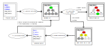

# Ciel: Compiler-induced Inconsistency Expression Locator

## Overview

Ciel is a tool framework that isolates compiler-induced numerical
inconsistencies in heterogeneous programs. It currently supports C/C++/CUDA
code.

Numerical program behavior may diverge when they are compiled and ran
differently. Many factors, such as different hardware architectures (for
example, the x87 FPU with its 80-bit registers), different compilers, or
different optimization flags (especially those that do not adhere to the
IEEE-754 2008 standard), may cause the results of floating-point computations to
become inconsistent. This kind of inconsistencies are known as *compiler-induced
numerical inconsistencies*. Ciel is a tool that automatically isolates these
inconsistencies in heterogeneous numerical programs. Given a program for which
an input is known to trigger inconsistent outputs under certain customizable
compilers and optimization flag combinations, Ciel isolates the minimal code
region (functions, blocks, statements, or expressions) that causes such
inconsistencies.

## How Ciel Works



Ciel is based on the clang/LLVM source-to-source compiler, with a Python-based
framework driver. Ciel uses a floating-point precision enhancement strategy,
guided by a recursive bisection search algorithm with increasing search
granularity, to identify the *program expressions* that induce numerical
inconsistencies due to compiler optimizations in heterogeneous code.

## Installation, Setup, and Running Example Programs

### Prerequisites

1. Linux system (Ubuntu 20.04 and Pop!_OS 20.04 tested). Also supports Ubuntu
   20.04 on WSL2.
2. An NVIDIA GPU with the proprietary GPU driver installed (driver version
   470/510 tested; GPUs with Compute Capability 7.0 or later tested).
3. 40 GiB free disk space recommended.
3. Docker is installed on your system, and it is verified that you can call
   `docker pull` with non-root user without using `sudo`.
4. NVIDIA container toolkit is installed with the instructions from [this
    link](https://docs.nvidia.com/datacenter/cloud-native/container-toolkit/install-guide.html)
    in the *Setting up NVIDIA Container Toolkit* section.
5. Clone this GitHub repository to a local directory of your choice.

```
git clone https://github.com/LLNL/Ciel [ciel directory]
```

### Setup Docker container with code repository

We have two options to setup the reproduction environment.

#### Option 1: pull and run Docker container from DockerHub

In the Linux terminal, execute the following commands to pull the Docker
container and run it. After entering the root user bash prompt inside the Docker
container, run `nvidia-smi` to check if the NVIDIA GPU on your PC is available
to the Docker container. If you can see detailed information about your NVIDIA
GPU when running `nvidia-smi`, this step is done.

```
./run_docker.sh
```

#### Option 2: build your own Docker container on local machine

Build the Docker image using the Dockerfile inside the code repository, then run
the Docker container. Please note that the RAM + swap area of your local PC must
be no less than 32GiB in order to finish building without errors. It takes
several hours to finish building the docker image.

```
cd [ciel directory]
docker build . -t ciel-image
docker run --gpus all -it -v [ciel directory]:/root/ciel/ --name ciel ciel-image
```

### Setup environments and Build the Clang plugins

1. Run initial setup script (`setup.sh`) to install third-party software
   required for some of the experiments.

```
cd /root/ciel
source setup.sh
```

2. Run the following command to detect the CUDA Compute Capability version for
your NVIDIA GPU and use this version to run the experiments.

```
source driver/setup_cc.sh
```

3. Then run the following command to build the Clang plugins.

```
./build_single_plugin.sh
```

Plugin compilation is done correctly when you see `Clang plugin installation
success.` in the output.

### Run the synthetic GPU experiments (Section 4.1 in the paper)

The synthetic GPU experiments contain 330 synthetic GPU programs generated by
Varity that are confirmed to contain compiler-induced numerical inconsistencies.

Run the following command to run all synthetic GPU programs. During experiment
execution, you can track your progress with the heartbeat output. **Estimated
runtime of all 330 programs is 3 hours.**

For individual results, you can check the files inside each `prog_[index]`
directory. 

* If there is a `results.out`, check its content to see the statements (lines)
  and expressions Ciel has isolated. You can compare it to the reference
  `results.txt` file to see if the results on your computer is the same as the
  reference results.
* If there is a `signature.out`, this means the inconsistencies reside in the
  program inputs. You can check if there is a reference `signature.txt` file, if
  yes, then the results on your computer is the same as the reference results.
```
cd /root/ciel/experiments_varity
python3 run_varity.py
```

### Run the NAS and Rodinia experiments (Section 4.1)

The NAS and Rodinia GPU experiments are CUDA programs from existing benchmarks
in https://github.com/GMAP/NPB-GPU and the CFD Solver in
https://www.cs.virginia.edu/rodinia/doku.php.

Run the following command to run Ciel on the NAS and Rodinia experiments.
**Estimated runtime of all 8 programs is 45 minutes.**

After it has finished, go to `results.out` file in each directory to check the
isolation results for each program. An `expected.txt` file is provided in each
directory as a sample log file of the reference results.

```
cd /root/ciel/experiments_nas_rodinia
python3 run_experiments.py
```

### Run the ECMWF CLOUDSC experiment (Section 4.1)

CLOUDSC experiment is from the develop branch of CLOUDSC, a standalone mini-app
of the ECMWF cloud microphysics parameterization in
https://github.com/ecmwf-ifs/dwarf-p-cloudsc/tree/develop.

Run the following command to run Ciel on the CLOUDSC experiment. **Estimated
runtime is 7 minutes.**

After it has finished, go to `results.out` file in each directory to check the
isolation results for each program.  An `expected.txt` file is provided in each
directory as a sample log file of the reference results.

```
cd /root/ciel/experiments_ecmwf
./cloudsc-bundle create # input "yes" when prompted by "Are you sure you want to continue connecting (yes/no/[fingerprint])?"
./run.sh
```

### Run the synthetic CPU experiments (Section 4.2)

These synthetic CPU experiments are the same from pLiner (Guo et al. SC 2020),
with the source code from
[here](https://github.com/LLNL/pLiner/tree/ef94b40ce71842ef782dd2d8ef5366327dfecb2a).
We use them here as comparison against the state-of-the-art.

Run the following command to run Ciel on the synthetic CPU experiments.
**Estimated runtime of all 50 programs is 2 minutes.**

After it has finished, go to `results.out` file in each `progtest_[index]`
directory to check the isolation results for each program.

* If there is a `results.out`, check its content to see the statements (lines)
  and expressions Ciel has isolated. You can compare it to the reference
  `results.txt` file to see if the results on your computer is the same as the
  reference results.
* If there is a `cant_solve.out`, it means Ciel cannot isolate the
  inconsistency.

```
cd /root/ciel/experiments_pliner
python3 run_experiments.py
```

### Run the NAS CPU experiments (Section 4.2)

These NAS CPU experiments are the same from pLiner (Guo et al. SC 2020), with
the source code from
[here](https://github.com/LLNL/pLiner/tree/ef94b40ce71842ef782dd2d8ef5366327dfecb2a).
We use them here as comparison against the state-of-the-art.

Run the following command to run Ciel on the NAS CPU experiments. **Estimated
runtime of all 3 programs is 48 minutes.**

After it has finished, go to `results.out` file in each directory to check the
isolation results for each program.  An `expected.txt` file is provided in each
directory as a sample log file of the reference results.

```
cd /root/ciel/experiments_pliner/varity_intel/
python3 run_varity.py
```

## License

Ciel is distributed under the terms of the MIT License.

See LICENSE and NOTICE for details.

LLNL-CODE-846084
